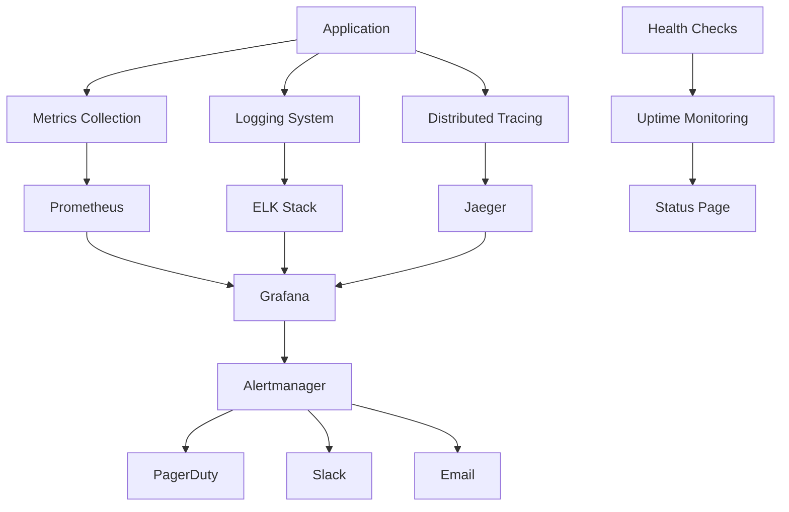

# 📊 Enterprise Monitoring & Observability

## Sistema Integral de Monitoreo y Observabilidad

### 🎯 Objetivo

Implementar un sistema completo de observabilidad que proporcione visibilidad total del sistema, detección proactiva de problemas y capacidades de troubleshooting avanzadas.

## 🏗️ Arquitectura de Observabilidad



## 📈 Metrics Collection (Prometheus)

### Application Metrics

```javascript
// src/infrastructure/monitoring/MetricsCollector.js
const promClient = require('prom-client');
const { createLogger } = require('../logging/EnhancedLogger');

class MetricsCollector {
  constructor() {
    this.logger = createLogger('MetricsCollector');
    this.register = new promClient.Registry();
    
    // Default metrics
    promClient.collectDefaultMetrics({ 
      register: this.register,
      prefix: 'streamio_',
      gcDurationBuckets: [0.001, 0.01, 0.1, 1, 2, 5]
    });
    
    this.initializeCustomMetrics();
  }

  initializeCustomMetrics() {
    // HTTP Request metrics
    this.httpRequestDuration = new promClient.Histogram({
      name: 'streamio_http_request_duration_seconds',
      help: 'Duration of HTTP requests in seconds',
      labelNames: ['method', 'route', 'status_code'],
      buckets: [0.1, 0.3, 0.5, 0.7, 1, 3, 5, 7, 10]
    });

    this.httpRequestTotal = new promClient.Counter({
      name: 'streamio_http_requests_total',
      help: 'Total number of HTTP requests',
      labelNames: ['method', 'route', 'status_code']
    });

    // Business metrics
    this.streamProcessingDuration = new promClient.Histogram({
      name: 'streamio_stream_processing_duration_seconds',
      help: 'Duration of stream processing operations',
      labelNames: ['operation_type', 'status'],
      buckets: [0.1, 0.5, 1, 2, 5, 10, 30, 60]
    });

    this.activeStreams = new promClient.Gauge({
      name: 'streamio_active_streams_total',
      help: 'Number of currently active streams',
      labelNames: ['stream_type']
    });

    this.cacheOperations = new promClient.Counter({
      name: 'streamio_cache_operations_total',
      help: 'Total cache operations',
      labelNames: ['operation', 'result']
    });

    this.databaseConnections = new promClient.Gauge({
      name: 'streamio_database_connections_active',
      help: 'Number of active database connections',
      labelNames: ['database']
    });

    // Error metrics
    this.errorTotal = new promClient.Counter({
      name: 'streamio_errors_total',
      help: 'Total number of errors',
      labelNames: ['error_type', 'severity', 'component']
    });

    // Register all metrics
    this.register.registerMetric(this.httpRequestDuration);
    this.register.registerMetric(this.httpRequestTotal);
    this.register.registerMetric(this.streamProcessingDuration);
    this.register.registerMetric(this.activeStreams);
    this.register.registerMetric(this.cacheOperations);
    this.register.registerMetric(this.databaseConnections);
    this.register.registerMetric(this.errorTotal);
  }

  // HTTP Middleware for automatic metrics collection
  httpMetricsMiddleware() {
    return (req, res, next) => {
      const start = Date.now();
      
      res.on('finish', () => {
        const duration = (Date.now() - start) / 1000;
        const route = req.route?.path || req.path;
        
        this.httpRequestDuration
          .labels(req.method, route, res.statusCode.toString())
          .observe(duration);
          
        this.httpRequestTotal
          .labels(req.method, route, res.statusCode.toString())
          .inc();
      });
      
      next();
    };
  }

  // Business metrics methods
  recordStreamProcessing(operationType, duration, status = 'success') {
    this.streamProcessingDuration
      .labels(operationType, status)
      .observe(duration);
  }

  setActiveStreams(streamType, count) {
    this.activeStreams.labels(streamType).set(count);
  }

  recordCacheOperation(operation, result) {
    this.cacheOperations.labels(operation, result).inc();
  }

  setDatabaseConnections(database, count) {
    this.databaseConnections.labels(database).set(count);
  }

  recordError(errorType, severity, component) {
    this.errorTotal.labels(errorType, severity, component).inc();
  }

  // Health check metrics
  async collectHealthMetrics() {
    try {
      // Database health
      const dbHealth = await this.checkDatabaseHealth();
      this.register.getSingleMetric('streamio_database_health')?.set(dbHealth ? 1 : 0);
      
      // Cache health
      const cacheHealth = await this.checkCacheHealth();
      this.register.getSingleMetric('streamio_cache_health')?.set(cacheHealth ? 1 : 0);
      
      // External services health
      const externalHealth = await this.checkExternalServicesHealth();
      this.register.getSingleMetric('streamio_external_services_health')?.set(externalHealth ? 1 : 0);
      
    } catch (error) {
      this.logger.error('Error collecting health metrics', { error: error.message });
    }
  }

  async checkDatabaseHealth() {
    // Implement database health check
    return true;
  }

  async checkCacheHealth() {
    // Implement cache health check
    return true;
  }

  async checkExternalServicesHealth() {
    // Implement external services health check
    return true;
  }

  getMetrics() {
    return this.register.metrics();
  }
}

module.exports = { MetricsCollector };
```

### Prometheus Configuration

```yaml
# monitoring/prometheus/prometheus.yml
global:
  scrape_interval: 15s
  evaluation_interval: 15s
  external_labels:
    cluster: 'streamio-production'
    environment: 'production'

rule_files:
  - "rules/*.yml"

alerting:
  alertmanagers:
    - static_configs:
        - targets:
          - alertmanager:9093

scrape_configs:
  # Streamio API
  - job_name: 'streamio-api'
    kubernetes_sd_configs:
    - role: endpoints
      namespaces:
        names:
        - streamio-production
    relabel_configs:
    - source_labels: [__meta_kubernetes_service_name]
      action: keep
      regex: streamio-api-service
    - source_labels: [__meta_kubernetes_endpoint_port_name]
      action: keep
      regex: metrics
    scrape_interval: 10s
    metrics_path: /metrics

  # Node Exporter
  - job_name: 'node-exporter'
    kubernetes_sd_configs:
    - role: node
    relabel_configs:
    - action: labelmap
      regex: __meta_kubernetes_node_label_(.+)
    - target_label: __address__
      replacement: kubernetes.default.svc:443
    - source_labels: [__meta_kubernetes_node_name]
      regex: (.+)
      target_label: __metrics_path__
      replacement: /api/v1/nodes/${1}/proxy/metrics

  # Kubernetes API Server
  - job_name: 'kubernetes-apiservers'
    kubernetes_sd_configs:
    - role: endpoints
    scheme: https
    tls_config:
      ca_file: /var/run/secrets/kubernetes.io/serviceaccount/ca.crt
    bearer_token_file: /var/run/secrets/kubernetes.io/serviceaccount/token
    relabel_configs:
    - source_labels: [__meta_kubernetes_namespace, __meta_kubernetes_service_name, __meta_kubernetes_endpoint_port_name]
      action: keep
      regex: default;kubernetes;https

  # MongoDB Exporter
  - job_name: 'mongodb-exporter'
    static_configs:
    - targets: ['mongodb-exporter:9216']
    scrape_interval: 30s

  # Redis Exporter
  - job_name: 'redis-exporter'
    static_configs:
    - targets: ['redis-exporter:9121']
    scrape_interval: 30s
```

### Alert Rules

```yaml
# monitoring/prometheus/rules/streamio-alerts.yml
groups:
- name: streamio.rules
  rules:
  # High Error Rate
  - alert: HighErrorRate
    expr: |
      (
        rate(streamio_http_requests_total{status_code=~"5.."}[5m]) /
        rate(streamio_http_requests_total[5m])
      ) > 0.05
    for: 2m
    labels:
      severity: critical
      service: streamio-api
    annotations:
      summary: "High error rate detected"
      description: "Error rate is {{ $value | humanizePercentage }} for the last 5 minutes"

  # High Response Time
  - alert: HighResponseTime
    expr: |
      histogram_quantile(0.95, 
        rate(streamio_http_request_duration_seconds_bucket[5m])
      ) > 1
    for: 5m
    labels:
      severity: warning
      service: streamio-api
    annotations:
      summary: "High response time detected"
      description: "95th percentile response time is {{ $value }}s"

  # Low Availability
  - alert: ServiceDown
    expr: up{job="streamio-api"} == 0
    for: 1m
    labels:
      severity: critical
      service: streamio-api
    annotations:
      summary: "Service is down"
      description: "Streamio API service has been down for more than 1 minute"

  # High Memory Usage
  - alert: HighMemoryUsage
    expr: |
      (
        process_resident_memory_bytes{job="streamio-api"} /
        container_spec_memory_limit_bytes{pod=~"streamio-api-.*"}
      ) > 0.8
    for: 5m
    labels:
      severity: warning
      service: streamio-api
    annotations:
      summary: "High memory usage"
      description: "Memory usage is {{ $value | humanizePercentage }}"

  # Database Connection Issues
  - alert: DatabaseConnectionIssues
    expr: streamio_database_connections_active < 1
    for: 2m
    labels:
      severity: critical
      service: database
    annotations:
      summary: "Database connection issues"
      description: "No active database connections detected"

  # Cache Miss Rate High
  - alert: HighCacheMissRate
    expr: |
      (
        rate(streamio_cache_operations_total{result="miss"}[5m]) /
        rate(streamio_cache_operations_total[5m])
      ) > 0.5
    for: 10m
    labels:
      severity: warning
      service: cache
    annotations:
      summary: "High cache miss rate"
      description: "Cache miss rate is {{ $value | humanizePercentage }}"
```

## 📝 Centralized Logging (ELK Stack)

### Enhanced Logger with Structured Logging

```javascript
// src/infrastructure/logging/StructuredLogger.js
const winston = require('winston');
const { ElasticsearchTransport } = require('winston-elasticsearch');

class StructuredLogger {
  constructor(service = 'streamio-api') {
    this.service = service;
    this.logger = this.createLogger();
  }

  createLogger() {
    const transports = [
      new winston.transports.Console({
        format: winston.format.combine(
          winston.format.timestamp(),
          winston.format.errors({ stack: true }),
          winston.format.json(),
          winston.format.colorize({ all: true })
        )
      })
    ];

    // Add Elasticsearch transport in production
    if (process.env.NODE_ENV === 'production') {
      transports.push(
        new ElasticsearchTransport({
          level: 'info',
          clientOpts: {
            node: process.env.ELASTICSEARCH_URL || 'http://elasticsearch:9200'
          },
          index: 'streamio-logs',
          indexTemplate: {
            name: 'streamio-logs-template',
            body: {
              index_patterns: ['streamio-logs-*'],
              settings: {
                number_of_shards: 1,
                number_of_replicas: 1
              },
              mappings: {
                properties: {
                  '@timestamp': { type: 'date' },
                  level: { type: 'keyword' },
                  message: { type: 'text' },
                  service: { type: 'keyword' },
                  traceId: { type: 'keyword' },
                  spanId: { type: 'keyword' },
                  userId: { type: 'keyword' },
                  requestId: { type: 'keyword' },
                  duration: { type: 'long' },
                  statusCode: { type: 'integer' },
                  method: { type: 'keyword' },
                  url: { type: 'keyword' },
                  userAgent: { type: 'text' },
                  ip: { type: 'ip' }
                }
              }
            }
          }
        })
      );
    }

    return winston.createLogger({
      level: process.env.LOG_LEVEL || 'info',
      format: winston.format.combine(
        winston.format.timestamp(),
        winston.format.errors({ stack: true }),
        winston.format.json(),
        winston.format.printf(info => {
          return JSON.stringify({
            timestamp: info.timestamp,
            level: info.level,
            message: info.message,
            service: this.service,
            ...info
          });
        })
      ),
      defaultMeta: {
        service: this.service,
        environment: process.env.NODE_ENV || 'development',
        version: process.env.APP_VERSION || '1.0.0'
      },
      transports
    });
  }

  // Structured logging methods
  info(message, meta = {}) {
    this.logger.info(message, this.enrichMeta(meta));
  }

  error(message, meta = {}) {
    this.logger.error(message, this.enrichMeta(meta));
  }

  warn(message, meta = {}) {
    this.logger.warn(message, this.enrichMeta(meta));
  }

  debug(message, meta = {}) {
    this.logger.debug(message, this.enrichMeta(meta));
  }

  // HTTP Request logging
  logRequest(req, res, duration) {
    this.info('HTTP Request', {
      method: req.method,
      url: req.url,
      statusCode: res.statusCode,
      duration,
      userAgent: req.get('User-Agent'),
      ip: req.ip,
      requestId: req.id,
      userId: req.user?.id,
      traceId: req.traceId,
      spanId: req.spanId
    });
  }

  // Business operation logging
  logBusinessOperation(operation, data = {}) {
    this.info(`Business Operation: ${operation}`, {
      operation,
      ...data,
      category: 'business'
    });
  }

  // Security event logging
  logSecurityEvent(event, data = {}) {
    this.warn(`Security Event: ${event}`, {
      event,
      ...data,
      category: 'security'
    });
  }

  // Performance logging
  logPerformance(operation, duration, data = {}) {
    this.info(`Performance: ${operation}`, {
      operation,
      duration,
      ...data,
      category: 'performance'
    });
  }

  enrichMeta(meta) {
    return {
      ...meta,
      timestamp: new Date().toISOString(),
      hostname: process.env.HOSTNAME || 'unknown',
      pid: process.pid
    };
  }
}

module.exports = { StructuredLogger };
```

### Logstash Configuration

```yaml
# monitoring/logstash/pipeline/streamio.conf
input {
  beats {
    port => 5044
  }
}

filter {
  if [fields][service] == "streamio-api" {
    json {
      source => "message"
    }
    
    # Parse timestamp
    date {
      match => [ "timestamp", "ISO8601" ]
    }
    
    # Extract request information
    if [url] {
      grok {
        match => { "url" => "%{URIPATH:endpoint}(?:%{URIPARAM:params})?" }
      }
    }
    
    # Classify log levels
    if [level] == "error" {
      mutate {
        add_tag => [ "error" ]
      }
    }
    
    # Add geolocation for IP addresses
    if [ip] {
      geoip {
        source => "ip"
        target => "geoip"
      }
    }
    
    # Performance classification
    if [duration] {
      if [duration] > 5000 {
        mutate {
          add_tag => [ "slow_request" ]
        }
      }
    }
  }
}

output {
  elasticsearch {
    hosts => ["elasticsearch:9200"]
    index => "streamio-logs-%{+YYYY.MM.dd}"
  }
  
  # Send errors to alerting system
  if "error" in [tags] {
    http {
      url => "http://alertmanager:9093/api/v1/alerts"
      http_method => "post"
      format => "json"
      mapping => {
        "alerts" => [{
          "labels" => {
            "alertname" => "ApplicationError"
            "service" => "%{service}"
            "severity" => "warning"
          }
          "annotations" => {
            "summary" => "%{message}"
            "description" => "%{stack}"
          }
        }]
      }
    }
  }
}
```

## 🔍 Distributed Tracing (Jaeger)

### OpenTelemetry Integration

```javascript
// src/infrastructure/tracing/TracingSetup.js
const { NodeSDK } = require('@opentelemetry/sdk-node');
const { getNodeAutoInstrumentations } = require('@opentelemetry/auto-instrumentations-node');
const { JaegerExporter } = require('@opentelemetry/exporter-jaeger');
const { Resource } = require('@opentelemetry/resources');
const { SemanticResourceAttributes } = require('@opentelemetry/semantic-conventions');

class TracingSetup {
  constructor() {
    this.serviceName = 'streamio-api';
    this.serviceVersion = process.env.APP_VERSION || '1.0.0';
    this.environment = process.env.NODE_ENV || 'development';
  }

  initialize() {
    const jaegerExporter = new JaegerExporter({
      endpoint: process.env.JAEGER_ENDPOINT || 'http://jaeger:14268/api/traces',
    });

    const sdk = new NodeSDK({
      resource: new Resource({
        [SemanticResourceAttributes.SERVICE_NAME]: this.serviceName,
        [SemanticResourceAttributes.SERVICE_VERSION]: this.serviceVersion,
        [SemanticResourceAttributes.DEPLOYMENT_ENVIRONMENT]: this.environment,
      }),
      traceExporter: jaegerExporter,
      instrumentations: [
        getNodeAutoInstrumentations({
          '@opentelemetry/instrumentation-fs': {
            enabled: false, // Disable file system instrumentation
          },
        }),
      ],
    });

    sdk.start();
    
    console.log('Tracing initialized successfully');
    
    return sdk;
  }
}

// Custom tracing utilities
const { trace, context } = require('@opentelemetry/api');

class CustomTracing {
  static createSpan(name, operation) {
    const tracer = trace.getTracer('streamio-api');
    const span = tracer.startSpan(name);
    
    return context.with(trace.setSpan(context.active(), span), () => {
      try {
        const result = operation(span);
        span.setStatus({ code: 1 }); // OK
        return result;
      } catch (error) {
        span.recordException(error);
        span.setStatus({ code: 2, message: error.message }); // ERROR
        throw error;
      } finally {
        span.end();
      }
    });
  }

  static async createAsyncSpan(name, operation) {
    const tracer = trace.getTracer('streamio-api');
    const span = tracer.startSpan(name);
    
    return context.with(trace.setSpan(context.active(), span), async () => {
      try {
        const result = await operation(span);
        span.setStatus({ code: 1 }); // OK
        return result;
      } catch (error) {
        span.recordException(error);
        span.setStatus({ code: 2, message: error.message }); // ERROR
        throw error;
      } finally {
        span.end();
      }
    });
  }
}

module.exports = { TracingSetup, CustomTracing };
```

## 📊 Grafana Dashboards

### Main Application Dashboard

```json
{
  "dashboard": {
    "id": null,
    "title": "Streamio API - Production Dashboard",
    "tags": ["streamio", "api", "production"],
    "timezone": "browser",
    "panels": [
      {
        "id": 1,
        "title": "Request Rate",
        "type": "stat",
        "targets": [
          {
            "expr": "sum(rate(streamio_http_requests_total[5m]))",
            "legendFormat": "Requests/sec"
          }
        ],
        "fieldConfig": {
          "defaults": {
            "color": {
              "mode": "thresholds"
            },
            "thresholds": {
              "steps": [
                {"color": "green", "value": null},
                {"color": "yellow", "value": 100},
                {"color": "red", "value": 500}
              ]
            }
          }
        }
      },
      {
        "id": 2,
        "title": "Response Time P95",
        "type": "stat",
        "targets": [
          {
            "expr": "histogram_quantile(0.95, sum(rate(streamio_http_request_duration_seconds_bucket[5m])) by (le))",
            "legendFormat": "P95 Response Time"
          }
        ],
        "fieldConfig": {
          "defaults": {
            "unit": "s",
            "thresholds": {
              "steps": [
                {"color": "green", "value": null},
                {"color": "yellow", "value": 0.5},
                {"color": "red", "value": 1}
              ]
            }
          }
        }
      },
      {
        "id": 3,
        "title": "Error Rate",
        "type": "stat",
        "targets": [
          {
            "expr": "sum(rate(streamio_http_requests_total{status_code=~\"5..\"}[5m])) / sum(rate(streamio_http_requests_total[5m]))",
            "legendFormat": "Error Rate"
          }
        ],
        "fieldConfig": {
          "defaults": {
            "unit": "percentunit",
            "thresholds": {
              "steps": [
                {"color": "green", "value": null},
                {"color": "yellow", "value": 0.01},
                {"color": "red", "value": 0.05}
              ]
            }
          }
        }
      },
      {
        "id": 4,
        "title": "Active Streams",
        "type": "graph",
        "targets": [
          {
            "expr": "streamio_active_streams_total",
            "legendFormat": "{{stream_type}}"
          }
        ]
      },
      {
        "id": 5,
        "title": "Memory Usage",
        "type": "graph",
        "targets": [
          {
            "expr": "process_resident_memory_bytes{job=\"streamio-api\"}",
            "legendFormat": "Memory Usage"
          }
        ],
        "yAxes": [
          {
            "unit": "bytes"
          }
        ]
      },
      {
        "id": 6,
        "title": "CPU Usage",
        "type": "graph",
        "targets": [
          {
            "expr": "rate(process_cpu_seconds_total{job=\"streamio-api\"}[5m]) * 100",
            "legendFormat": "CPU Usage %"
          }
        ],
        "yAxes": [
          {
            "unit": "percent",
            "max": 100
          }
        ]
      }
    ],
    "time": {
      "from": "now-1h",
      "to": "now"
    },
    "refresh": "5s"
  }
}
```

### Business Metrics Dashboard

```json
{
  "dashboard": {
    "title": "Streamio - Business Metrics",
    "panels": [
      {
        "title": "Stream Processing Performance",
        "type": "heatmap",
        "targets": [
          {
            "expr": "sum(rate(streamio_stream_processing_duration_seconds_bucket[5m])) by (le, operation_type)",
            "format": "heatmap",
            "legendFormat": "{{operation_type}}"
          }
        ]
      },
      {
        "title": "Cache Hit Rate",
        "type": "stat",
        "targets": [
          {
            "expr": "sum(rate(streamio_cache_operations_total{result=\"hit\"}[5m])) / sum(rate(streamio_cache_operations_total[5m]))",
            "legendFormat": "Cache Hit Rate"
          }
        ],
        "fieldConfig": {
          "defaults": {
            "unit": "percentunit",
            "thresholds": {
              "steps": [
                {"color": "red", "value": null},
                {"color": "yellow", "value": 0.7},
                {"color": "green", "value": 0.9}
              ]
            }
          }
        }
      },
      {
        "title": "Database Connections",
        "type": "graph",
        "targets": [
          {
            "expr": "streamio_database_connections_active",
            "legendFormat": "{{database}}"
          }
        ]
      }
    ]
  }
}
```

## 🚨 Alertmanager Configuration

```yaml
# monitoring/alertmanager/alertmanager.yml
global:
  smtp_smarthost: 'localhost:587'
  smtp_from: 'alerts@streamio.company.com'
  slack_api_url: 'https://hooks.slack.com/services/YOUR/SLACK/WEBHOOK'

route:
  group_by: ['alertname', 'cluster', 'service']
  group_wait: 10s
  group_interval: 10s
  repeat_interval: 1h
  receiver: 'default'
  routes:
  - match:
      severity: critical
    receiver: 'critical-alerts'
  - match:
      severity: warning
    receiver: 'warning-alerts'

receivers:
- name: 'default'
  slack_configs:
  - channel: '#alerts'
    title: 'Streamio Alert'
    text: '{{ range .Alerts }}{{ .Annotations.summary }}{{ end }}'

- name: 'critical-alerts'
  slack_configs:
  - channel: '#critical-alerts'
    title: '🚨 CRITICAL: {{ .GroupLabels.alertname }}'
    text: |
      {{ range .Alerts }}
      *Alert:* {{ .Annotations.summary }}
      *Description:* {{ .Annotations.description }}
      *Severity:* {{ .Labels.severity }}
      *Service:* {{ .Labels.service }}
      {{ end }}
    send_resolved: true
  pagerduty_configs:
  - routing_key: 'YOUR_PAGERDUTY_KEY'
    description: '{{ .GroupLabels.alertname }}: {{ .GroupLabels.instance }}'

- name: 'warning-alerts'
  slack_configs:
  - channel: '#warnings'
    title: '⚠️ WARNING: {{ .GroupLabels.alertname }}'
    text: |
      {{ range .Alerts }}
      *Alert:* {{ .Annotations.summary }}
      *Description:* {{ .Annotations.description }}
      {{ end }}
    send_resolved: true

inhibit_rules:
- source_match:
    severity: 'critical'
  target_match:
    severity: 'warning'
  equal: ['alertname', 'cluster', 'service']
```

## 🏥 Health Checks & Uptime Monitoring

### Comprehensive Health Check

```javascript
// src/infrastructure/health/HealthChecker.js
class HealthChecker {
  constructor(dependencies) {
    this.dependencies = dependencies;
    this.checks = new Map();
    this.registerDefaultChecks();
  }

  registerDefaultChecks() {
    this.registerCheck('database', () => this.checkDatabase());
    this.registerCheck('cache', () => this.checkCache());
    this.registerCheck('external-apis', () => this.checkExternalAPIs());
    this.registerCheck('disk-space', () => this.checkDiskSpace());
    this.registerCheck('memory', () => this.checkMemory());
  }

  registerCheck(name, checkFunction) {
    this.checks.set(name, checkFunction);
  }

  async runAllChecks() {
    const results = {};
    const startTime = Date.now();

    for (const [name, checkFunction] of this.checks) {
      try {
        const checkStart = Date.now();
        const result = await Promise.race([
          checkFunction(),
          new Promise((_, reject) => 
            setTimeout(() => reject(new Error('Timeout')), 5000)
          )
        ]);
        
        results[name] = {
          status: 'healthy',
          responseTime: Date.now() - checkStart,
          details: result
        };
      } catch (error) {
        results[name] = {
          status: 'unhealthy',
          error: error.message,
          responseTime: Date.now() - checkStart
        };
      }
    }

    const overallStatus = Object.values(results).every(r => r.status === 'healthy') 
      ? 'healthy' : 'unhealthy';

    return {
      status: overallStatus,
      timestamp: new Date().toISOString(),
      duration: Date.now() - startTime,
      checks: results,
      version: process.env.APP_VERSION || '1.0.0',
      uptime: process.uptime()
    };
  }

  async checkDatabase() {
    // Implement database connectivity check
    return { connected: true, latency: 10 };
  }

  async checkCache() {
    // Implement cache connectivity check
    return { connected: true, latency: 5 };
  }

  async checkExternalAPIs() {
    // Implement external API checks
    return { apis: ['api1', 'api2'], allHealthy: true };
  }

  async checkDiskSpace() {
    const fs = require('fs');
    const stats = fs.statSync('/');
    const freeSpace = stats.free / stats.size;
    
    return {
      freeSpacePercentage: freeSpace * 100,
      healthy: freeSpace > 0.1 // 10% minimum
    };
  }

  async checkMemory() {
    const used = process.memoryUsage();
    const total = require('os').totalmem();
    const usage = used.heapUsed / total;
    
    return {
      memoryUsagePercentage: usage * 100,
      healthy: usage < 0.8 // 80% maximum
    };
  }
}

module.exports = { HealthChecker };
```

## 📊 SLA Monitoring & Reporting

### SLA Calculator

```javascript
// src/infrastructure/monitoring/SLACalculator.js
class SLACalculator {
  constructor(metricsCollector) {
    this.metrics = metricsCollector;
    this.slaTargets = {
      availability: 99.9, // 99.9% uptime
      responseTime: 500,  // 500ms P95
      errorRate: 0.1     // 0.1% error rate
    };
  }

  async calculateSLA(timeRange = '24h') {
    const [availability, responseTime, errorRate] = await Promise.all([
      this.calculateAvailability(timeRange),
      this.calculateResponseTime(timeRange),
      this.calculateErrorRate(timeRange)
    ]);

    return {
      period: timeRange,
      timestamp: new Date().toISOString(),
      metrics: {
        availability: {
          actual: availability,
          target: this.slaTargets.availability,
          status: availability >= this.slaTargets.availability ? 'met' : 'breached'
        },
        responseTime: {
          actual: responseTime,
          target: this.slaTargets.responseTime,
          status: responseTime <= this.slaTargets.responseTime ? 'met' : 'breached'
        },
        errorRate: {
          actual: errorRate,
          target: this.slaTargets.errorRate,
          status: errorRate <= this.slaTargets.errorRate ? 'met' : 'breached'
        }
      },
      overallStatus: this.calculateOverallStatus(availability, responseTime, errorRate)
    };
  }

  async calculateAvailability(timeRange) {
    // Query Prometheus for uptime metrics
    const query = `avg_over_time(up{job="streamio-api"}[${timeRange}]) * 100`;
    return await this.queryPrometheus(query);
  }

  async calculateResponseTime(timeRange) {
    // Query Prometheus for P95 response time
    const query = `histogram_quantile(0.95, rate(streamio_http_request_duration_seconds_bucket[${timeRange}])) * 1000`;
    return await this.queryPrometheus(query);
  }

  async calculateErrorRate(timeRange) {
    // Query Prometheus for error rate
    const query = `(sum(rate(streamio_http_requests_total{status_code=~"5.."}[${timeRange}])) / sum(rate(streamio_http_requests_total[${timeRange}]))) * 100`;
    return await this.queryPrometheus(query);
  }

  calculateOverallStatus(availability, responseTime, errorRate) {
    const availabilityMet = availability >= this.slaTargets.availability;
    const responseTimeMet = responseTime <= this.slaTargets.responseTime;
    const errorRateMet = errorRate <= this.slaTargets.errorRate;

    if (availabilityMet && responseTimeMet && errorRateMet) {
      return 'all_targets_met';
    } else if (availabilityMet && (responseTimeMet || errorRateMet)) {
      return 'partial_targets_met';
    } else {
      return 'targets_breached';
    }
  }

  async queryPrometheus(query) {
    // Implement Prometheus query logic
    return 0; // Placeholder
  }
}

module.exports = { SLACalculator };
```

## 📋 Monitoring Checklist

### Setup Checklist
- [ ] **Metrics Collection**: Prometheus configured and scraping
- [ ] **Logging**: ELK stack deployed and ingesting logs
- [ ] **Tracing**: Jaeger configured for distributed tracing
- [ ] **Dashboards**: Grafana dashboards created and configured
- [ ] **Alerting**: Alert rules defined and tested

### Operational Checklist
- [ ] **Health Checks**: All endpoints responding correctly
- [ ] **SLA Monitoring**: Targets defined and tracked
- [ ] **Alert Fatigue**: Alert thresholds tuned appropriately
- [ ] **Runbooks**: Incident response procedures documented
- [ ] **On-Call**: Rotation schedule established

### Performance Checklist
- [ ] **Response Time**: P95 < 500ms
- [ ] **Error Rate**: < 0.1%
- [ ] **Availability**: > 99.9%
- [ ] **Resource Usage**: CPU < 70%, Memory < 80%
- [ ] **Capacity Planning**: Growth trends monitored

---

*Enterprise Monitoring & Observability Guide v1.0*  
*Optimizado para Producción*  
*Basado en SRE Best Practices*  
*Validado para Entornos Críticos*